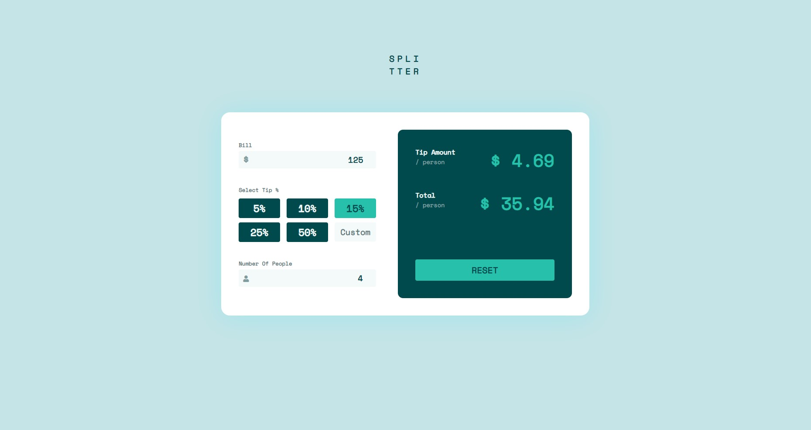

# Frontend Mentor - Tip calculator app solution

This is a solution to the [Tip calculator app challenge on Frontend Mentor](https://www.frontendmentor.io/challenges/tip-calculator-app-ugJNGbJUX). Frontend Mentor challenges help you improve your coding skills by building realistic projects.

## Table of contents

-   [Overview](#overview)
    -   [The challenge](#the-challenge)
    -   [Screenshot](#screenshot)
    -   [Links](#links)
-   [My process](#my-process)
    -   [Built with](#built-with)
    -   [What I learned](#what-i-learned)
    -   [Continued development](#continued-development)
-   [Author](#author)

## Overview

### The challenge

Users should be able to:

-   View the optimal layout for the app depending on their device's screen size
-   See hover states for all interactive elements on the page
-   Calculate the correct tip and total cost of the bill per person

### Screenshot

### Links

-   Solution URL: [GitHub Repo](https://github.com/Sandip2k/tip-calculator-app)
-   Live Site URL: [codepen.io](https://codepen.io/sandip2k/pen/bGWrPYw)

## My process

### Built with

-   Semantic HTML5 markup
-   CSS custom properties
-   Flex-box
-   Mobile-first workflow

### What I learned

This challenge was a nice practice, and I was able to revise my CSS skills, namely media queries and flex-box. Also used setInterval which allows output to change with the input.

### Continued development

I will try to use more flex-box, less media queries and follow CSS best practices in my next challenge.

## Author

-   Frontend Mentor - [@Sandip2k](https://www.frontendmentor.io/profile/Sandip2k)
-   GitHub - [@Sandip2k](https://www.twitter.com/yourusername)
